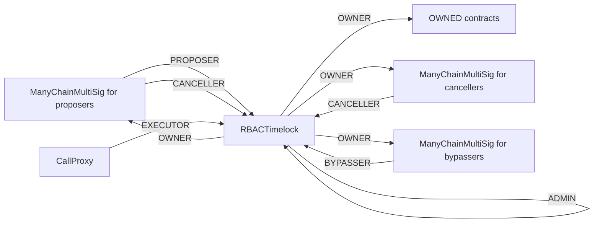
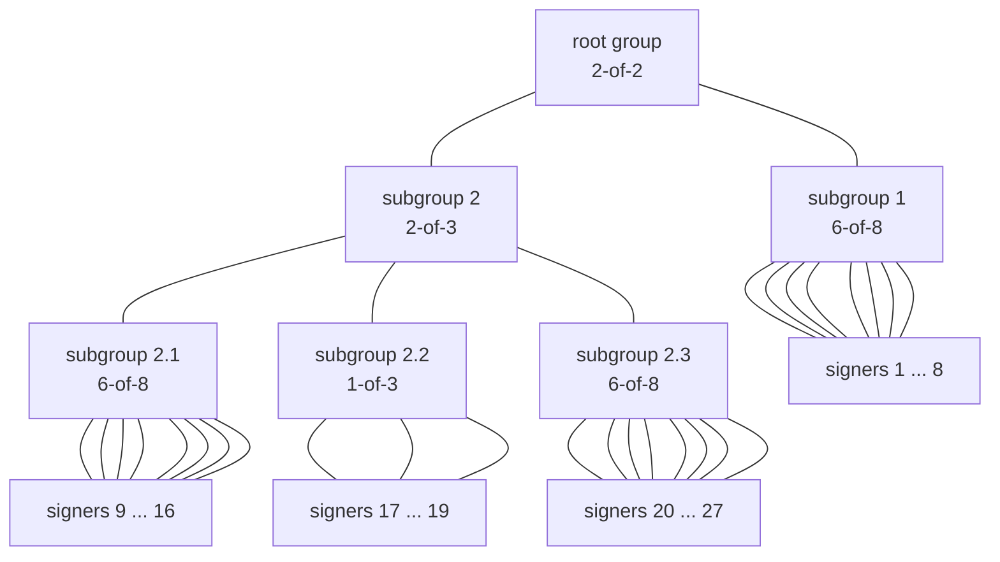

# Chainlink CCIP Owner Contracts

This repo contains a set of contracts used for admistering Chainlink contracts,
most notably [CCIP](https://chain.link/cross-chain).

The contracts in this repo are considered production-grade and have been
reviewed as part of a [code4rena contest](https://code4rena.com/contests/2023-07-chainlink-cross-chain-contract-administration-multi-signature-contract-timelock-and-call-proxies#top).

## Development

We use [foundry](https://book.getfoundry.sh/). The tests rely on some ffi code written in Go 1.18 (see `testCommands/`).
See the [official Go docs](https://go.dev/doc/install) for installation instructions.
Once you have Go running, `forge test --ffi` should do the trick.

Format code with `forge fmt`.

Generate a code coverate report by running `./coverage.sh`.

## Design Considerations

The `CallProxy`, `ManyChainMultiSig`, `RBACTimelock` contracts are all part of a system of `owner` contracts that is supposed to administer other contracts (henceforth referred to as `OWNED`). `OWNED` contracts represent any system of contracts that (1) have an `owner` or similar role (e.g. using OpenZeppelin's `OwnableInterface`) and that (2) are potentially deployed across multiple chains.


Here is a diagram of how we envision these contracts to interact:



Regular administration of the `OWNED` contracts is expected to happen through
the `RBACTimelock`'s Proposer/Executor/Canceller roles. The Bypasser role is
expected to only become active in "break-glass" type emergency scenarios where
waiting for `RBACTimelock.minDelay` would be harmful.

Proposers can also cancel so that they may "undo" proposals with mistakes in them.

Gas cost isn't particularly important for these contracts because they're not expected to
be called often. Correctness matters much more.

### `RBACTimelock` Considerations

We expect to set `RBACTimelock.minDelay` and `delay` to ~ 24 hours, but in general values
between 1 hour and 1 month should be supported.
This enables anyone to inspect configuration changes to the `OWNED` contracts before
they take effect. For example, a user that disagrees with a configuration change might choose
to withdraw funds stored in `OWNED` contracts before they can be executed. 

We may use `RBACTimelock.blockFunctionSelector` to prevent specific functions on the
`OWNED` contracts from being called through the regular propose-execute flow.

`RBACTimelock`` is based on an OpenZeppelin contract. We intentionally use the
old `require` syntax (and some other old techniques) in `RBACTimelock` to keep
the diff vs the original OZ contract smaller.

### `CallProxy` Considerations

The `CallProxy` is intentionally callable by anyone. Offchain tooling used for
generating configuration changes will make appropriate use of the `RBACTimelock`'s
support for `predecessor`s to ensure that configuration changes are sequenced properly
even if an adversary is executing them. Since the adversary can control the gas amount
and gas price, callees are expected to not have gas-dependent behavior other than
reverting if insufficient gas is supplied.

The `CallProxy` is not expected to be used with contracts that could `SELFDESTRUCT`. It thus has no
`EXTCODESIZE`-check prior to making a call. We expect it to be configured correctly (i.e. pointing to a real `RBACTimelock`) on deployment.

### `ManyChainMultiSig` Considerations

Unlike standard multi-sig contracts, `ManyChainMultiSig` supports signing many transactions
targeting many chains with a single set of signatures. (We currently only target EVM chains
and all EVM chains support the same ECDSA secp256k1 standard.) This is useful for administering
systems of contracts spanning many chains without increasing signing overhead linearly with the
number of supported chains. We expect to use the same set of EOA signers across many chains.Consequently, `ManyChainMultiSig` only supports EOAs as signers, *not* other smart contracts.
Similar to the rest of the system, *anyone* who can furnish a correct Merkle proof is allowed to execute authorized calls on the `ManyChainMultiSig`, including a potential adversary. The
adversary will be able to control the gas price and gas amount for the execution.

The proposer and canceller `ManyChainMultiSig` contracts are expected to be
configured with a group structure like this, with different sets of signers for each
(exact k-of-n parameters might differ):

```
          ┌──────────┐
          │Root Group│
      ┌──►│  6-of-8  │◄─────────┐
      │   └──────────┘          │
      │         ▲               │
      │         │               │
 ┌────┴───┐ ┌───┴────┐     ┌────┴───┐
 │signer 1│ │signer 2│ ... │signer 8│
 └────────┘ └────────┘     └────────┘
```

The bypasser `ManyChainMultiSig` contract is expected to be configured with a
more complex group structure like this (exact structure might differ):



Subgroup 1 has the same signers as the canceller `ManyChainMultiSig`. No change can ever be enacted
without approval of this group.

In practice, we expect the k-of-n configurations of groups to typically have `1<=k<=32` and 
`1<=n<=32` (where `k<=n` and we tolerate the overall limits on groups/signers set in 
`ManyChainMultiSig` code).

We intentionally store chain ids in uint256, foregoing some storage savings. We want to minimize the
likelihood of having to change the contract later to support larger chain ids and the cost savings
aren't very significant since we don't envision setting new roots all that frequently.
We are aware of a [proposal](https://ethereum-magicians.org/t/eip-2294-explicit-bound-to-chain-id/11090)
to bound chain ids to 64 bits, but it is still unresolved.

We choose the tried-and-true OpenZeppelin Merkle tree. We remain conservative and don't make use of 
multiproofs for the sake of simplicity. The same KISS approach also leads us to not make use of a 
Merkle tries with support for storing key-value-pairs (e.g. sparse Merkle trees). Such tries would 
enable us to compute a unique key for each Op, preventing e.g. two Ops with the same nonce and 
multisig contract from being included in the trie. However, the practical benefit of doing so seems 
limited: a faulty set of signers can take far more damaging actions that putting two conflicting 
transactions in the trie.

### Propose-and-Execute Flow

The following steps need to be performed for a set of onchain maintenance operations on the `OWNED` contracts:
- [offchain, out of scope] Merkle tree generation & signing: A Merkle tree containing all the required `ManyChainMultiSig` ops (containing `RBACTimelock.scheduleBatch` calls) for the desired maintenance operations is generated by the proposers. A quorum of signers from the proposer `ManyChainMultiSig` must sign (offchain) the Merkle root.
- `setRoot` call on all relevant `ManyChainMultiSig` contracts across chains: The signed Merkle root is then sent to `ManyChainMultiSig`s. Anyone who has been given the root and the signatures offchain can send it to `ManyChainMultiSig`s.
- `execute` on `ManyChainMultiSig`: To propose an action to the `RBACTimelock`, a multi-sig op is executed by providing a Merkle proof for that specific op. Anyone who has been given the full Merkle tree offchain can propose the action.
- `executeBatch` on `RBACTimelock`: After the timelock wait period expires, the proposed actions in TimeLock can be executed. This assumes that the cancellers have not cancelled them in the meantime. Anyone can execute the actions because all the required information is available on the blockchain through event logs.

### Canceller Flow

This can be thought of as an optional step of the propose-and-execute flow. If a quorum of cancellers disapproves of an action pending on the
`RBACTimelock`, they can create a set of `ManyChainMultiSig.Op`s that calls `RBACTimelock.cancel` on
all relevant `RBACTimelock`s.

### Bypasser Flow

This is completely independent of the propose-and-execute flow.
Bypassers create a set of `ManyChainMultiSig.Op`s that calls `RBACTimelock.bypasserExecuteBatch` on
all relevant `RBACTimelock`s.

